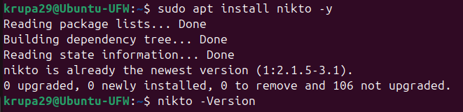
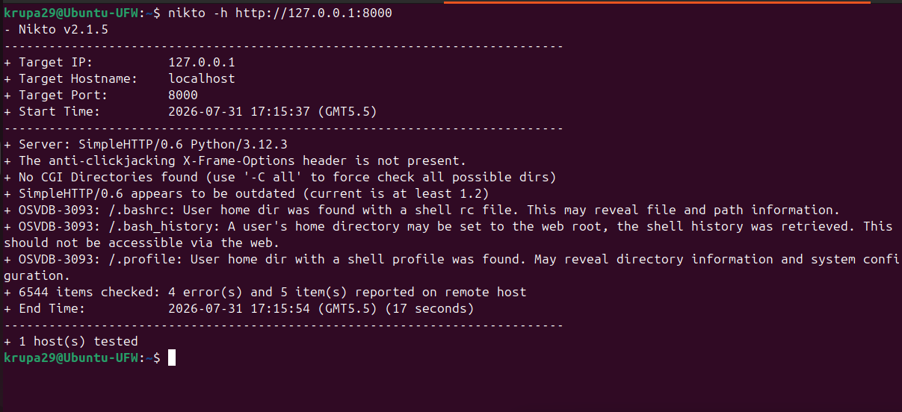
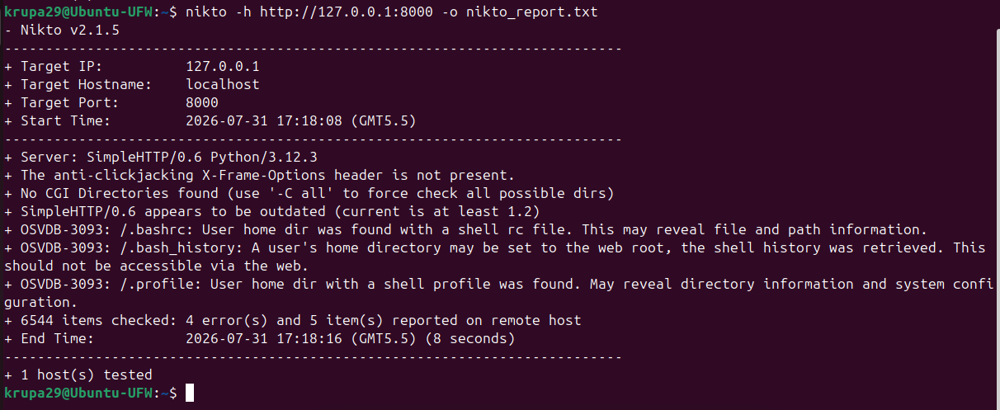
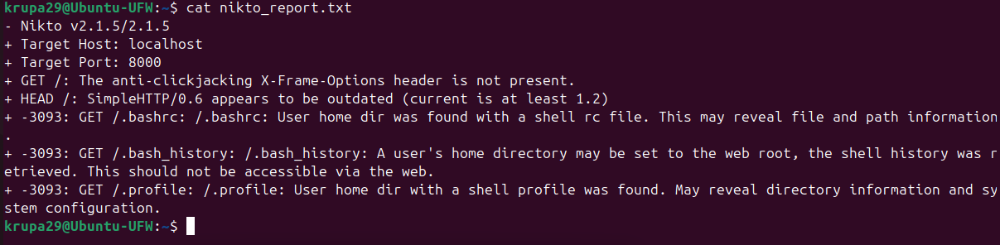

# Vulnerability Scanning Report Using Nikto

## Task Information

**Task Name:** Vulnerability Scanning Using Nikto

**Platform:** Ubuntu Linux

**Scanning Tool:** Nikto Web Vulnerability Scanner

---

# Introduction

Nikto is an open-source web server vulnerability scanner that checks web servers for outdated software, insecure configurations, and common security issues. It helps identify potential vulnerabilities that may affect the security of a web application.

The objective of this task was to install Nikto, perform a vulnerability scan on a local web server, save the scan results, and analyze the findings.

---

# Software Used

- Ubuntu Linux
- Nikto
- Python HTTP Server
- Linux Terminal

---

# Steps Performed

## 1. Installed Nikto

Nikto was installed using the Ubuntu package manager.

```bash
sudo apt update
sudo apt install nikto -y
```

### Screenshot



---

## 2. Started a Local Web Server

A local web server was started using Python.

```bash
python3 -m http.server 8000
```

---

## 3. Performed Vulnerability Scan

Nikto was used to scan the local web server.

```bash
nikto -h http://127.0.0.1:8000
```

### Screenshot



---

## 4. Saved the Scan Report

The scan results were saved to a text file.

```bash
nikto -h http://127.0.0.1:8000 -o nikto_report.txt
```

### Screenshot



---

## 5. Viewed the Report

The saved report was displayed using the following command:

```bash
cat nikto_report.txt
```

### Screenshot



---

# Results

The Nikto scan successfully analyzed the local web server and generated a vulnerability report. The report contained information about the web server configuration and any detected security findings.

---

# Conclusion

This task provided practical experience in performing a basic vulnerability assessment using Nikto. It demonstrated how to install the tool, scan a web server, save the results, and review the generated report. Vulnerability scanning is an important part of maintaining secure web applications and identifying potential security risks.

---

# Learning Outcomes

- Learned how to install Nikto.
- Performed a web server vulnerability scan.
- Generated and saved a vulnerability report.
- Understood how Nikto detects common web server security issues.
- Gained practical experience with vulnerability assessment on Linux.
